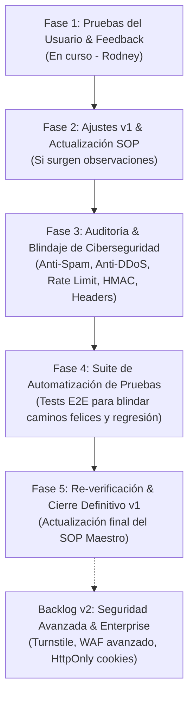

# Roadmap Oficial: Cierre de v1, Blindaje de Ciberseguridad y Automatización

Este documento establece el contrato de trabajo y la secuencia de pasos para cerrar de forma definitiva la **v1 del Portal de Clientes y Telemetría Centralizada**, asegurando que quede **blindada contra ciberataques, protegida contra abuso/DDoS y con pruebas automatizadas** que garanticen que ninguna actualización futura rompa los caminos ya validados.

---

## 🗺️ Fases del Roadmap para el Cierre de la v1

---

## 📌 Detalle de Fases

### Fase 1: Pruebas en Vivo por el Usuario (En Curso)
- **Responsable:** Rodney.
- **Alcance:**
  - Probar la experiencia completa en los 3 clientes activos:
    - [Cabaña del Árbol](https://cabana-del-arbol-demo.vercel.app/portal)
    - [Terrazas Bungalow](https://terrazasbungalow.com.py/portal)
    - [Don Mendoza](https://donmendoza.com.py/portal)
  - Validar:
    - Recepción del correo vía Resend.
    - Clic en el enlace y visualización del loader *"Accediendo... Validando tu enlace de acceso seguro"*.
    - Visualización del dashboard de métricas reales (visitas, WhatsApp, ciudades, dispositivos).
    - Cierre de sesión y comportamiento en dispositivos móviles.
- **Entregable:** Feedback con observaciones o visto bueno de la experiencia de usuario.

---

### Fase 2: Ajustes de Feedback & Sincronización del SOP
- **Alcance:**
  - Resolver de forma inmediata cualquier detalle de diseño, copy o flujo reportado en la Fase 1.
  - Si hubo modificaciones de interfaz o parámetros, sincronizar el [SOP Maestro](./sop_mipyme_express_alquileres.md).

---

### Fase 3: Auditoría de Ciberseguridad, Blindaje y Anti-Abuso (v1)
Esta fase tiene como objetivo blindar el sistema contra actores malintencionados y proteger la cuota de servicios externos (Resend, Neon Postgres, Vercel Functions).

1. **Protección Anti-Spam y Anti-DDoS en el Input de Correo (`/api/portal/magic-link`)**:
   - **Rate Limiting por IP (Sliding Window)**: Limitar a un máximo razonable (ej. 3 solicitudes cada 10 minutos por IP) para evitar ataques de fuerza bruta o agotamiento de cuota de Resend.
   - **Cooldown por Email**: Si ya se envió un correo a una casilla específica, imponer un tiempo de espera mínimo (ej. 60 a 90 segundos) antes de permitir otro envío a la misma dirección.
   - **Campo Honeypot Invisible**: Campo oculto para usuarios legítimos que, si es completado por un bot, descarta la solicitud en silencio sin enviar correos ni gastar recursos.
   - **Sanitización y Validación Estricta**:
     - Validación RFC 5322 de formato de correo.
     - Límite estricto de longitud de caracteres (máx. 120 caracteres).
     - Rechazo de payloads malformados o inyecciones de encabezados SMTP.
   - **Mitigación de Enumeración de Correos (Timing-Attack Defense)**:
     - Retornar tiempos de respuesta homogéneos y mensajes neutros para evitar que un atacante deduzca qué correos existen en la base de datos de clientes y cuáles no.

2. **Blindaje de Tokens e Integridad Criptográfica**:
   - Verificación estricta de firma HMAC SHA-256 con secreto criptográfico independiente.
   - Validación de expiración (7 días exactos) y consistencia de `siteSlug`.
   - Control de fuga de tokens en encabezados `Referer`.

3. **Protección del Tracker de Telemetría (`/api/tracker`)**:
   - Rate limiting en la ingesta de eventos para impedir ataques de inflación artificial de visitas o saturación de la base de datos.
   - Sanitización de parámetros de eventos y normalización de URLs.
   - Anonimización unidireccional de IPs (hashing salt-based) para cumplimiento estricto de privacidad sin cookies.

4. **Cabeceras de Seguridad HTTP**:
   - Aplicar directivas de seguridad en todas las respuestas del portal:
     - `X-Content-Type-Options: nosniff`
     - `X-Frame-Options: SAMEORIGIN` (o `DENY`)
     - `Referrer-Policy: strict-origin-when-cross-origin`
     - `Content-Security-Policy` ajustada y restrictiva.

---

### Fase 4: Automatización de Pruebas (Test Suite de Regresión)
Para asegurar que los caminos ya validados nunca se rompan con futuros cambios o parches de seguridad:

1. **Creación de Suite Automatizada**:
   - Implementar tests de integración y E2E (usando Playwright / scripts de Node.js en TypeScript).
2. **Casos de Prueba Cubiertos**:
   - ✅ **Camino Feliz 1**: Solicitud de Magic Link con correo autorizado -> Respuesta exitosa y estructura de mensaje correcta.
   - ✅ **Camino Feliz 2**: Apertura con token válido -> Transición del loader *"Accediendo..."* a despliegue de métricas.
   - 🛡️ **Seguridad 1**: Intento con token adulterado o con firma falsa -> Rechazo 401/403 inmediato y redirección a login.
   - 🛡️ **Seguridad 2**: Intento con token expirado -> Error claro de expiración sin parpadeo del panel.
   - 🛡️ **Seguridad 3**: Token perteneciente a `siteA` intentando usarse en `siteB` -> Rechazo por inconsistencia de `siteSlug`.
   - 🛡️ **Anti-Spam 1**: Ráfaga de solicitudes masivas en el input de correo -> Activación del Rate Limiting (HTTP 429 Too Many Requests).
   - 🛡️ **Anti-Spam 2**: Solicitud con honeypot completado -> Bloqueo silencioso sin disparo de correo.
   - 📱 **UI / Responsividad**: Verificación de carga limpia en viewport móvil y desktop.

---

### Fase 5: Re-verificación, Sincronización Final del SOP y Cierre v1
- Ejecutar la suite completa de pruebas automatizadas.
- Realizar prueba cruzada manual de confirmación.
- Documentar en el [SOP Maestro](./sop_mipyme_express_alquileres.md) y en [Arquitectura SentinelIDPY](./sentinel_platform_architecture.md):
  - Las reglas de ciberseguridad activas.
  - Cómo ejecutar los tests automatizados antes de cualquier despliegue futuro.
- **Hito Oficial:** Cierre exitoso y congelamiento de la **v1**.

---

## 🔮 Backlog para la v2 (Seguridad Avanzada & Enterprise)

Ideas y mejoras para cuando la flota supere los 50-100 clientes o se requiera un nivel de cumplimiento corporativo superior:

1. **Cloudflare Turnstile / Captcha Invisible**:
   - Verificación invisible en segundo plano para el formulario de login sin resolver captchas manuales molestos.
2. **Tokens de 1 Solo Uso + Cookies HttpOnly**:
   - Al pulsar el enlace del correo, el token se consume (one-time token) y se canjea por una cookie de sesión cifrada `HttpOnly; Secure; SameSite=Lax`.
   - Impide que el token permanezca en el historial del navegador o pueda ser reutilizado si el correo es compartido.
3. **Panel de Auditoría de Ciberseguridad en SentinelIDPY Admin**:
   - Gráfico de intentos bloqueados por Rate Limiting.
   - Registro de accesos sospechosos o intentos de inyección.
   - Lista negra (Blocklist) de IPs maliciosas administrable desde el dashboard.
4. **WAF & Firewall Rules en Vercel / Cloudflare**:
   - Reglas automáticas de mitigación DDoS a nivel de red (L7) antes de tocar las serverless functions.
