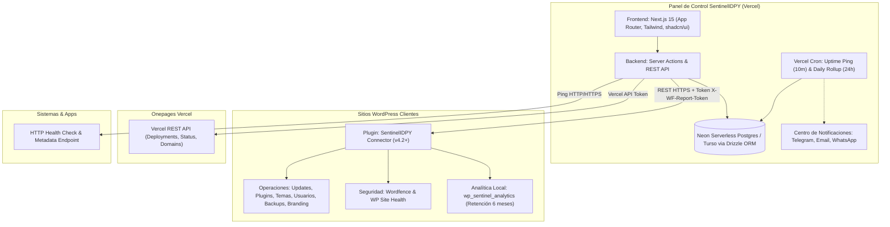

# SentinelIDPY — Arquitectura y Plan Maestro de la Plataforma

Plataforma central de administración, monitoreo, mantenimiento y gestión de infraestructura para la cartera de clientes de Impulsos Digitales.
Desplegada en **Vercel**, conectada con sitios **WordPress** (mediante *SentinelIDPY Connector*), **Onepages en Vercel** y **Sistemas a medida** (webapps y apps móviles).

---

## 1. Diagrama de Arquitectura

---

## 2. Base de Datos y Estimación de Almacenamiento

### Proveedor Seleccionado: **Neon Serverless Postgres** (con opción de migración a Turso)
- **Capa Gratuita**: 500 MB (Neon) / 5 GB (Turso).
- **Conexión Serverless**: Adaptador HTTP/WebSocket nativo sin saturar pools de conexiones.
- **ORM**: Drizzle ORM (permite cambiar entre Postgres y Turso/SQLite modificando únicamente el driver).

### Estimación y Optimización de Almacenamiento (100 clientes)

1. **Tablas Relacionales Estáticas**:
   - Clientes, Sitios, Mapeo de Infraestructura, Templates: **< 3 MB**.
2. **Histórico de Uptime y Salud**:
   - Pings detallados de cada 10 min: Retención rodante de **30 días** (~26 MB fijos).
   - Rollup diario permanente (`site_uptime_daily`): ~3,6 MB al año.
   - Huella total de Uptime: **~30 MB permanentes**.
3. **Analítica de 6 meses**:
   - Cada sitio WordPress registra sus visitas en su propia base de datos (`wp_sentinel_analytics`).
   - El panel central solo consulta y almacena resúmenes consolidados mensuales/diarios (~10 MB para 100 sitios por 6 meses).
4. **Proyección Total**:
   - **~45 MB a 60 MB al año para 100 clientes**.
   - Vida útil en la capa gratuita de 500 MB: **más de 6 a 10 años**.

---

## 3. Mapeador de Infraestructura por Cliente (Ficha Técnica de Activos)

Cada cliente cuenta con una ficha técnica consolidada para auditar y generar el mapa de servicios con su costo anual:

- **Dominio**:
  - Proveedor (ej. nic.py, Namecheap, GoDaddy).
  - Responsable de renovación (Cliente vs. Agencia).
  - Fecha de expiración y costo anual.
- **Hosting / Servidor**:
  - Proveedor (ej. Hosting Paraguay cPanel, Vercel, Render, VPS, AWS).
  - Plan contratado, cuota de disco y costo.
- **DNS**:
  - Dónde se gestionan las zonas DNS (cPanel, Cloudflare, Route53, nic.py).
- **Correo Corporativo / Email**:
  - Proveedor (Correo de cPanel, Google Workspace, Microsoft 365, Zoho).
  - Cantidad de cuentas, plan y costo.
- **Sistemas / Plataformas Adicionales**:
  - Vercel (Plan Impulsos Digitales), Render, repositorios GitHub, Firebase, etc.
- **Resumen Financiero**:
  - Cálculo automático del valor anualizado de la infraestructura del cliente.

---

## 4. Canales Centralizados de Notificaciones

La configuración de canales se administra desde la sección de Ajustes del panel:

1. **Telegram**:
   - Bot Token y Chat ID configurables en el panel.
   - Envío de alertas de caída de sitios (Uptime down / HTTP != 200).
   - Notificaciones de ataques masivos bloqueados por Wordfence.
   - Solicitud o generación de reportes bajo demanda.
2. **Email (SMTP / Resend)**:
   - Envío de alertas críticas y futuros resúmenes mensuales en PDF.
3. **WhatsApp (Webhook / API)**:
   - Canal preparado para notificaciones directas al cliente de renovación o mantenimiento.

---

## 5. Extensión del Conector WordPress (v4.2+)

El plugin en `plugin/src/wordpress-plugin/sentinel-idpy-connector.php` expone los siguientes endpoints REST protegidos por el token de 32 caracteres (`X-WF-Report-Token`):

| Endpoint | Método | Descripción |
| :--- | :--- | :--- |
| `/sentinel/v1/stats` | `GET` | Métricas de Wordfence, disco, salud, versiones y Matomo. |
| `/sentinel/v1/updates` | `GET` | Lista detallada de actualizaciones pendientes (core, plugins, themes). |
| `/sentinel/v1/updates/apply` | `POST` | Aplica actualizaciones seleccionadas con reporte de progreso. |
| `/sentinel/v1/plugins` | `GET` | Lista todos los plugins instalados y sus versiones. |
| `/sentinel/v1/plugins/install` | `POST` | Instala desde slug de WordPress.org o subida de archivo ZIP. |
| `/sentinel/v1/plugins/toggle` | `POST` | Activa o desactiva un plugin remotamente. |
| `/sentinel/v1/themes` | `GET` | Lista los temas instalados y el tema activo. |
| `/sentinel/v1/users` | `GET` | Lista los usuarios del sitio (ID, login, email, rol). |
| `/sentinel/v1/users/reset-password` | `POST` | Envía email o genera enlace de restablecimiento seguro. |
| `/sentinel/v1/backups` | `GET` | Estado de copias en UpdraftPlus / Google Drive. |
| `/sentinel/v1/backups/run` | `POST` | Dispara una copia de seguridad inmediata. |
| `/sentinel/v1/agency/branding` | `GET/POST` | Personaliza logo de login, fondo y pie de página de WP Admin. |
| `/sentinel/v1/admin/widgets` | `GET/POST` | Oculta/muestra widgets predeterminados del dashboard de WordPress. |
| `/sentinel/v1/performance` | `GET/POST` | Detecta plugins de caché e implementa purga remota. |
| `/sentinel/v1/config/export` | `GET` | Exporta configuración de plugins (`wp_options`). |
| `/sentinel/v1/config/diff` | `POST` | Compara configuración del sitio con plantilla dorada y reporta drift. |
| `/sentinel/v1/config/apply` | `POST` | Sobrescribe opciones con la plantilla dorada. |
| `/sentinel/v1/analytics/summary` | `GET` | Retorna resumen analítico de los últimos 6 meses (visitas, páginas, fuentes). |

---

## 6. Flujo de Ramas Git

- `main`: Rama de producción lista para desplegar en Vercel.
- `develop`: Rama de desarrollo activo donde se integran y prueban todas las nuevas características antes de pasar a producción.
